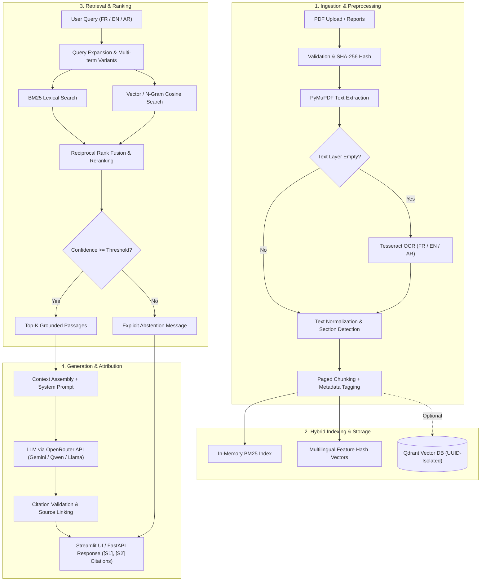

# PolicyRAG & Insight Assistant

A Streamlit prototype designed to query and analyze public policy reports in French, English, and Arabic. It ingests PDFs, extracts text page-by-page, applies fallback Tesseract OCR to scanned pages when necessary, indexes passages with precise metadata, and generates strictly grounded answers from retrieved context.

> The three preloaded reports are **entirely fictional** and provided solely for testing the user interface. They are not official UN/UNDP publications; their figures must not be cited as real-world results.

---

## Key Features

- **Multi-PDF Ingestion**: Signature/format validation, file size checks (20 MB), page limits (500 pages), SHA-256 deduplication, and filename sanitization.
- **Paged Text Extraction**: PyMuPDF extraction with text cleaning and heuristic section/heading detection.
- **Fallback OCR**: Integrated Tesseract OCR (French, English, Arabic) for scanned documents or image-based pages.
- **Metadata-Preserving Chunking**: Retains document ID, filename, page number, section, language, and unique chunk identifier.
- **Hybrid Retrieval**: Combines BM25 lexical ranking and multilingual character n-gram feature hashing with confidence thresholds and explicit abstention.
- **Multilingual LLM Generation**: Query expansion, translation, and strictly grounded answers in FR/EN/AR via OpenRouter (default: `google/gemini-2.0-flash-exp:free` / `qwen/qwen3.8-27b:free` / OpenAI-compatible API).
- **Specialized Analysis Modes**: Question Answering (QA), Executive Summary, Deep Explanation, Cross-Report Comparison, Structured Extraction (Recommendations, Risks, Objectives, Indicators, Stakeholders), Translation, and Policy Insights.
- **Verifiable Citations**: `[S1]`, `[S2]` source attribution linked to retrieved passages, displaying document name, page number, section header, and excerpt.
- **Session State Memory**: Multi-turn conversational context preserved across user queries.
- **Optional Qdrant Integration**: Remote vector database adapter partitioned by workspace UUID. When `QDRANT_URL` is omitted, the system runs fully self-contained in local memory.
- **FastAPI REST Service & Testing**: Parallel FastAPI backend, Pytest test suite, trilingual deterministic evaluation harness, Dockerfile, and Docker Compose setup.

---

## Architecture



> **Note on Local Vector Search**: Local retrieval utilizes character n-gram feature hashing to keep the project lightweight, portable, and dependency-free. These are **not neural dense embeddings** (such as BGE-M3 or multilingual-e5). For a high-scale production deployment requiring dense semantic embeddings, connect the vector adapter to BGE-M3/e5 with Qdrant.

---

## Quickstart

### Prerequisites

- **Python 3.11+**
- **Tesseract OCR** with language packs for French (`fra`), English (`eng`), and Arabic (`ara`).
- **OpenRouter API Key** configured in your `.env` file (or deployment platform secrets) for LLM-powered generation.

### Linux / Ubuntu Installation

```bash
# 1. Install system dependencies & Tesseract OCR
sudo apt-get update
sudo apt-get install -y tesseract-ocr tesseract-ocr-eng tesseract-ocr-fra tesseract-ocr-ara

# 2. Clone repository & set up Python virtual environment
python3 -m venv .venv
source .venv/bin/activate

# 3. Install Python dependencies
pip install -r requirements.txt

# 4. Configure environment variables
cp env.template .env
```

Edit your `.env` file to set `OPENROUTER_API_KEY`. The `.env` file is excluded from version control and read exclusively server-side. **No API key is entered via the Streamlit interface.**

### OpenRouter API Key & Free Tier

1. Generate an API key at [OpenRouter Keys](https://openrouter.ai/keys).
2. The default model is configured to `google/gemini-2.0-flash-exp:free` (or `qwen/qwen3.8-27b:free`).
3. Free models on OpenRouter offer a baseline tier (subject to OpenRouter's rate limits and availability policies; see [OpenRouter FAQ](https://openrouter.ai/docs/faq)).
4. Without an API key, the system remains functional for **local hybrid retrieval, citation lookup, and extractive answers**.

---

### Running the Streamlit Application

```bash
streamlit run app.py --server.address 0.0.0.0 --server.port 8501
```

Access the interface at `http://localhost:8501`.

---

### Running the FastAPI REST API

In a separate terminal:

```bash
uvicorn api:app --host 127.0.0.1 --port 8000
```

- **Interactive API Documentation (Swagger)**: `http://127.0.0.1:8000/docs`
- **Available Endpoints**:
  - `GET /health` — Health check
  - `POST /api/workspaces` — Initialize an isolated workspace
  - `GET /api/workspaces/{id}/documents` — List indexed documents
  - `POST /api/workspaces/{id}/documents` — Upload and index a PDF
  - `DELETE /api/workspaces/{id}/documents/{document_id}` — Delete a document
  - `POST /api/ask` — Query the RAG engine

---

## Testing and Evaluation

```bash
# Run unit & integration test suite
pytest -q

# Run deterministic benchmark evaluation
python -m evaluation.evaluate
```

The benchmark is fully deterministic and does not call external LLMs. It evaluates **Recall@3**, **MRR@3**, and **Abstention Accuracy** across a synthetic trilingual evaluation corpus.

---

## Optional Qdrant Vector Store

Uploaded documents are indexed in-memory within the Streamlit session by default. To enable persistent remote vector storage:

1. Configure `QDRANT_URL` and `QDRANT_API_KEY` in your `.env`.
2. Document vectors and passages sent to Qdrant are automatically isolated by `workspace_id`.
3. If `QDRANT_URL` is unset or unreachable, the system smoothly falls back to local in-memory retrieval.

---

## Docker Deployment

```bash
# 1. Copy environment configuration
cp env.template .env

# 2. Build and run containers
docker compose up --build
```

- Streamlit Web UI: `http://localhost:8501`
- FastAPI REST API: `http://localhost:8000/docs`

---

## Production Considerations & Limitations

- **Session Volatility**: In-memory storage is scoped to the Streamlit session; uploaded PDFs are not persisted to disk by default.
- **API Availability**: The `:free` LLM variants depend on OpenRouter's upstream availability and rate limits.
- **Evaluation Scope**: The gold evaluation set is synthetic; build a domain-specific evaluation dataset for institutional use.
- **Feature Hashing**: Feature hashing is designed for lightweight portability. For production semantic search, upgrade to a dedicated dense embedding model (e.g., BGE-M3, multilingual-e5) paired with Qdrant.
- **Security & Multi-Tenancy**: The prototype uses workspace UUIDs for capacity routing; add authentication (OAuth2/OIDC), rate limiting, and access control policies before public production exposure.

---

## Project Structure

```text
├── app.py                     # Streamlit web application & user interface
├── api.py                     # FastAPI REST API endpoints & schemas
├── policyrag/
│   ├── ingestion.py           # PDF parsing, OCR fallback, section detection, chunking
│   ├── retrieval.py           # BM25 + feature hash retrieval, reranking, abstention
│   ├── generation.py          # OpenRouter LLM client, prompt templates, citation formatting
│   ├── service.py             # Orchestration service for assistant modes
│   ├── qdrant_store.py        # Optional remote Qdrant vector database adapter
│   ├── models.py              # Pydantic data models & typing
│   └── demo.py                # Synthetic trilingual policy reports
├── tests/                     # Unit and integration test suite
├── evaluation/                # Gold evaluation dataset and retrieval metrics
├── requirements.txt           # Python package dependencies
├── Dockerfile                 # Multi-stage container definition
└── docker-compose.yml         # Container orchestration config
```
